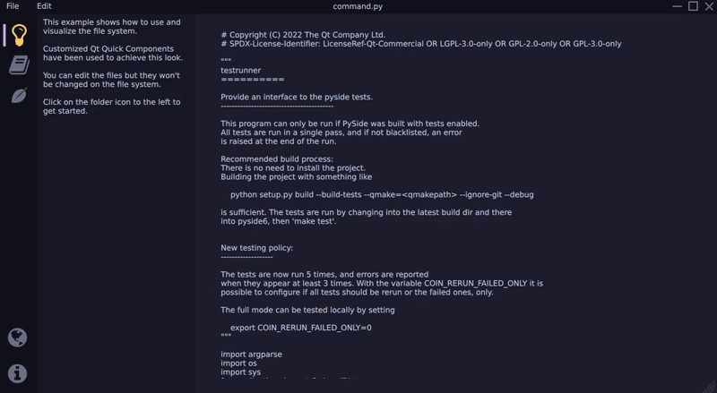
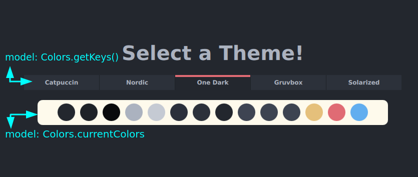

(tutorial_extendedexplorer)=

# Extending the file system explorer example

This tutorial shows how to extend the
[Filesystem Explorer Example](example_quickcontrols_filesystemexplorer)
by adding a simple scheme manager. This feature will allow you to switch color
schemes during the application's runtime. The color schemes will be declared in
JSON format and made available through a custom Python-QML plugin.



## Defining the color schemes

To define your color scheme, you can use the same color names as the original
example, so you don't have to rename every occurrence. The original colors are
defined in the `Colors.qml` file as follows:

```{literalinclude} resources/Colors.qml
---
language: QML
caption: true
linenos: true
lines: 7-22
---
```

The `schemes.json` file holds the color schemes. To start implementing this, you
can use the [Catppuccin](https://github.com/catppuccin/catppuccin) scheme.

```{literalinclude} schemes.json
---json
caption: true
linenos: true
start-at: "Catppuccin"
end-at: "},"
---
```

In addition to the "Catppuccin" color scheme, four other color schemes got
implemented: Nordic, One Dark, Gruvbox, and Solarized. However, feel free to get
creative and experiment with **your** schemes.

To define a new color scheme, copy the structure from above and provide your
color values

## Implement the scheme manager

After defining the color schemes, you can implement the actual scheme manager.
The manager will read the `schemes.json` file and provide QML bindings to switch
between schemes during runtime.

To implement the scheme manager, create a Python-QML plugin that exposes the
`SchemeManager` object to QML. This object will have methods to load the color
schemes from the `schemes.json` file and switch between them.

Create a new Python file called `schememanager.py` in your project directory. In
this file, define the **SchemeManager** class:

```{literalinclude} scheme_manager.py
---
language: python
caption: true
linenos: true
start-at: "QML_IMPORT_NAME"
end-at: "class SchemeManager"
---
```

To integrate smoothly into the already existing code, attach the SchemeManager
to the same QML module that's already present with
`QML_IMPORT_NAME = "FileSystemModule"`. Additionally, use the`@QmlNamedElement`
decorator to smoothly transition to using the custom plugin instead of the
`Colors.qml` file. With these changes, we can avoid editing all previous
assignments like:

```QML
import FileSystemModule
...
Rectangle {
    color: Colors.background
}
```

The constructor reads the `schemes.json` file once upon application start and
then calls the `setTheme` member function.

```{literalinclude} scheme_manager.py
---
language: python
caption: true
linenos: true
lines: 18-24
---
```

By adding the `SchemeManager` as a callable QML element named **Colors** to the
FileSystemModule, the class is now accessible in the code without the need to
import it each time or edit previous assignments. This, in turn, will streamline
the workflow.

After defining the schemes in the JSON format and making the `SchemeManager`
class a callable element from QML under the name **Colors**, there are two
remaining steps to fully integrate the new scheme manager in the example.

The **first step** is to create a function in the `SchemeManager` class that
loads a color scheme from the JSON file. The **second step** is to make the
individual colors available in QML with the *same name* as used before with the
syntax `Colors.<previousName>` as assignable properties.


```{literalinclude} scheme_manager.py
---
language: python
caption: true
linenos: true
lines: 26-31
---
```

The `setScheme` method is responsible for switching between color schemes. To
make this method accessible in QML, use the `@Slot(str)` decorator and specify
that it takes a string as its input parameter. In this method, we populate a
dictionary with the color values from the JSON file.

> Note: For simplicity reasons no other error checking is performed.
> You would probably want to validate the keys contained in the json.

```{literalinclude} scheme_manager.py
---
language: python
caption: true
linenos: true
start-at: "@Property(QColor"
end-at: "return"
---
```

To make the color property assignable in QML, use the `@Property` decorator.
We simply return the corresponding color value from the dictionary for each
property. This process is repeated for all other colors that are used in the
application.
At this point the application should start with the colors provided by the
active scheme in the constructor.

## Add the scheme switching to QML

To visualize the current scheme and enable interactive scheme switching, start
by adding a new entry to the `Sidebar.qml` file.

```{literalinclude} FileSystemModule/qml/Sidebar.qml
---
language: QML
caption: true
linenos: true
lines: 99-105
---
```

To update the main content area of the application to display the `ColorScheme`,
the logic that checks the active index from the Sidebar buttons needs to be
modified. The necessary changes will be made to the Main.qml file:

```{literalinclude} FileSystemModule/Main.qml
---
language: QML
caption: true
linenos: true
lines: 170-187
---
```

In addition, change the behavior of the application so that there are two
`StackLayouts`: one for the resizable navigation and one for the main content
area where we display our color scheme switching functionality. These changes
will also be made to the Main.qml file.

```{literalinclude} FileSystemModule/Main.qml
---
language: QML
caption: true
linenos: true
lines: 147-150
---
```

To complete our implementation, the `ColorScheme.qml` file needs to be created.
The implementation is straightforward and follows the same principles as in the
original example. If anything is unclear, please refer to the documentation
provided there. To display all colors and scheme names, use a `Repeater`. The
model for the Repeater is provided by our `scheme_manager.py`file as a
`QStringList`.

```{literalinclude} FileSystemModule/qml/ColorScheme.qml
---
language: QML
caption: true
linenos: true
lines: 97-111
---
```

When examining the code in more detail, you will notice that there are different
ways to retrieve the models. The `getKeys()` method is defined as a **Slot** and
therefore requires parentheses when called. On the other hand, the `currentColors`
model is defined as a **property** and is therefore assigned as a property in QML.
The reason for this is to receive notifications when the color scheme is switched
so that the colors displayed in the application can be updated. The keys for the
color schemes are loaded only once at application startup and do not rely on any
notifications.


