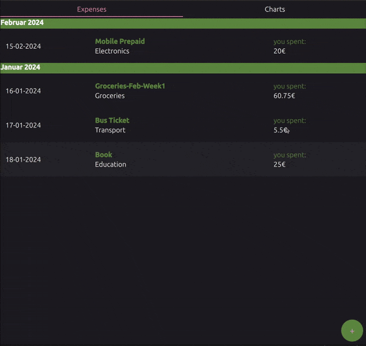
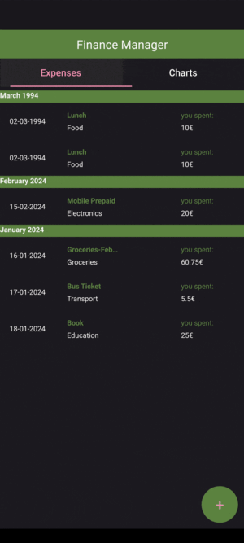

(tutorial_financemanager_partone)=

# Finance Manager Tutorial - Part 1

In this tutorial, we will create a finance manager app using QtQuick and PySide6. The app will allow
you to add your expenses and visualize them using a pie charts based on the category of spending.
The application is designed in a way that it is compatible with Desktop and Android platforms.





To download the complete source code for this tutorial, visit
{ref}`example_tutorials_finance_manager_part1`.

## Prerequisites

Before we begin, firstly make sure you have Python 3.9+ and PySide6 installed within you Python
environment. You can install it using pip:

```bash
pip install PySide6
```

## Project Design

The finance manager app is a simple app demonstrating the use of PySide6 to integrate QtQuick with
Python, allowing for a seamless combination of QML for the user interface and Python for the backend
logic. It will have the following components:

1. Expense List: This list will display all the entered expenses, showing the expense name, amount,
   category and date. The expenses are organized by their month and year.

2. PieChart: This chart will visualize the expenses based on their categories, giving users a clear
   overview of their spending habits.

3. Add Expense: A dialog enabling the user to add new expenses.

The overall project structure will be as follows:

```
finance_manager/
├── main.py
├── financemodel.py
├── Finance/
│   ├── Main.qml
│   ├── FinanceView.qml
│   ├── FinanceDelegate.qml
│   ├── FinancePieChart.qml
│   ├── AddDialog.qml
│   └── qmldir
```
## Let's get started!

### Component Overview

In the first part of this tutorial, we will start by creating the Expense List using some
pre-defined expenses. For this, we will create a new Python file `financemodel.py` that
defines a class **FinanceModel** that will be used to manage the expenses from Python and expose
it to QML.

<details>
<summary class="prominent-summary">financemodel.py</summary>

```{literalinclude} ../../../../../../../../../examples/tutorials/finance_manager/part1/financemodel.py
---
language: python
caption: FinanceModel class definition
linenos: true
---
```
</details>

Here's a brief overview of the `FinanceModel` class, its components and methods:

1. **QML type registration**
   - The `FinanceModel` class is registered as a QML type using the {deco}`~PySide6.QtQml.QmlElement`
   decorator. This decorator is used to define a Python class as a QML type, allowing it to be used
   in QML files.
   - The `QML_IMPORT_NAME` variable is used to define the name of the module that will be imported
    in QML to access the `FinanceModel` class.
2. **Members**
    - **FinanceRole Enum**: Defines custom roles for the model data, such as `ItemNameRole`,
        `CategoryRole`, `CostRole`, `DateRole` and `MonthRole`.
    - **Finance Dataclass**: Represents an individual expense with the attributes `item_name`,
        `category`, `cost`, `date` and `month`.
    - **init Method**: Initializes the model with some pre-defined expenses.
    - **rowCount Method**: Returns the number of items in the model.
    - **data Method**: Returns the data for a given role and index in the model.
    - **getCategoryData Method**: Returns a dictionary the total cost for each category in the
      model. This method has the `@Slot` decorator to make it accessible from QML.
    - **roleNames Method**: Maps role names to their `QByteArray` values.
    - **get Method**: A `@Slot` method to get the expense data at a given index.
    - **append Method**: A `@Slot` method to append a new expense to the model.

For using as a data model in the `ListView` component in QML, the methods `rowCount`, `data`, and
`roleNames` are required.

Now that we have defined the `FinanceModel` class, let's create the QML components to display the
expenses. First, we create `Finance/Main.qml` file that will be the main QML file for our app.

<details>
<summary class="prominent-summary">Main.qml</summary>

```{literalinclude} ../../../../../../../../../examples/tutorials/finance_manager/part1/Finance/Main.qml
---
language: QML
caption: Main.qml
linenos: true
---
```
</details>

In the `Main.qml` we import the created `Finance` QML module file and the file has the following components:

1. **ApplicationWindow**:
   - The main window of the application.
   - Sets the theme to `Material.Dark` and accent color to `Material.Gray`.
   - Adjusts the window size to the screen dimensions.
   - Contains the title "Finance Manager".

2. **ToolBar**:
   - A toolbar that is only visible on mobile platforms (Android and iOS). Note that PySide6
     supports only Android, but you can use the same code with Qt C++ for iOS.
   - Contains a `Label` with the text "Finance Manager".

3. **ColumnLayout**:
   - A layout that arranges its children in a column.
   - Fills the entire window.

4. **TabBar**:
   - Contains two `TabButton` components for switching between **Expense** and **Charts** views.

5. **StackLayout**:
   - A layout that stacks its children on top of each other.
   - Contains two `Item`components for the "Expenses" and "Charts" views.

6. **FinanceView**:
   - A custom component to display the list of expenses.
   - Binds to the `finance_model`.
   - This component is defined in the `FinanceView.qml` file.

7. **FinancePieChart**:
   - A custom component to display a pie chart of expenses by category.
   - Updates the chart with data from `finance_model.getCategoryData()` when the component is
     completed.
   - This component is defined in the `FinancePieChart.qml` file.

8. **FinanceModel**:
   - The data model created from Python to store finance data. This is imported by import the
     QML module `Finance` in the `Main.qml` file.

9. **AddDialog**:
   - A dialog for adding new expense entries.
   - Appends new entries to `finance_model` and updates the pie chart.

10. **RoundButton**:
    - A circular button to open the `AddDialog.qml`.
    - Positioned at the bottom-right corner of the window.
    - Contains a "+" symbol and has a highlighted appearance.

Now that we have the basic structure of the main QML file, let's create the `FinanceView.qml` file:

<details>
<summary class="prominent-summary">FinanceView.qml</summary>

```{literalinclude} ../../../../../../../../../examples/tutorials/finance_manager/part1/Finance/FinanceView.qml
---
language: QML
caption: FinanceView.qml
linenos: true
---
```
</details>

`FinanceView.qml` contains the following components:

1. **ListView**:
   - The main container for displaying a list of items.
   - Fills the entire parent container using `anchors.fill: parent`.
   - Uses the `financeModel` property as its data model.

2. **property var financeModel**:
   - A property to hold the data model for the list.
   - This model is expected to be passed from the parent component. In this case, it is passed from
     the `Main.qml` file.

3. **delegate**:
   - Defines how each item in the `ListView` should be displayed.
   - Uses a custom component `FinanceDelegate` to render each item. This component is defined in the
     `FinanceDelegate.qml` file.
   - Sets the width of each delegate to match the width of the `ListView`.

4. **model**:
   - Binds the `ListView` to the `financeModel` property.
   - The `ListView` will display items based on the data in `financeModel`.

5. **section**:
   - The section property is used to group the items in the list view based on the month of the
     expense.

6. **ScrollBar.vertical**:
   - Adds a vertical scrollbar to the `ListView`.
   - Ensures that users can scroll through the list if the content exceeds the visible area.

These components together create a scrollable list view for displaying financial data, with each
item rendered using the `FinanceDelegate` component.

Next, let's create the `FinanceDelegate.qml` file:

<details>
<summary class="prominent-summary">FinanceDelegate.qml</summary>

```{literalinclude} ../../../../../../../../../examples/tutorials/finance_manager/part1/Finance/FinanceDelegate.qml
---
language: QML
caption: FinanceDelegate.qml
linenos: true
---
```
</details>

`FinanceDelegate.qml` contains the following components:

1. **ItemDelegate**:
   - The root element of the delegate.
   - Represents a single item in the `ListView`.

2. **RowLayout**:
   - A layout that arranges its children horizontally.
   - Contains multiple elements to display different parts of the financial data.

3. **Label (dateLabel)**:
   - Displays the date of the expense.

4. **ColumnLayout**:
   - A layout that arranges its children vertically.
   - Contains labels for the item name and category.

5. **Label (item_name)**:
   - Displays the name of the item.

6. **Label (category)**:
   - Displays the category of the transaction.

7. **Item**:
   - A spacer item to take up the remaining space in the `RowLayout` so that the last label is
     aligned to the right.

8. **ColumnLayout (cost section)**:
   - A layout that arranges its children vertically.
   - Contains labels for the cost description and the actual cost.

9. **Label ("you spent:")**:
   - Displays the static text "you spent:"

10. **Label (cost)**:
    - Displays the cost of the transaction.

These components together create a detailed and structured visual representation of each financial
transaction in the `ListView`, displaying the date, item name, category, and cost in a readable format.

Then we create the `FinancePieChart.qml` file:

<details>
<summary class="prominent-summary">FinancePieChart.qml</summary>

```{literalinclude} ../../../../../../../../../examples/tutorials/finance_manager/part1/Finance/FinancePieChart.qml
---
language: QML
caption: FinancePieChart.qml
linenos: true
---
```
</details>

`FinancePieChart.qml` contains the following components:

1. **Item**:
   - The root element of the QML file.
   - Sets the width and height to match the screen dimensions.

2. **GraphsView**:
   - A container for displaying charts. This was introduced with
     Qt 6.8 with Qt Graphs module.

3. **PieSeries**:
   - A series type for creating pie charts. This is also a part of the
     Qt Graphs module.

4. **Text**
   - A title for the pie chart.

5. **updateChart(data)**:
   - A JavaScript function to update the pie chart with new data.
   - Clears existing slices in the PieSeries.
   - Iterates over the provided data to create new slices.
   - Each slice is labeled with the category name and value in euros.

These components together create a responsive pie chart that can be dynamically updated with new
data.

Finally, we create the `AddDialog.qml` file:

<details>
<summary class="prominent-summary">AddDialog.qml</summary>

```{literalinclude} ../../../../../../../../../examples/tutorials/finance_manager/part1/Finance/AddDialog.qml
---
language: QML
caption: AddDialog.qml
linenos: true
---
```
</details>

`AddDialog.qml` contains the following components:

1. **Dialog**:
   - Root element for the dialog.: Identifier for the dialog.
   - `signal finished(...)`: Custom signal emitted when the dialog is accepted. In this case, it
     is emitted when the user adds a new expense.

3. **ColumnLayout**:
   - Container for the dialog fields.

4. **TextField**:
   - Input fields for the item name, category, cost and date.

5. **Function `createEntry()`**:
   - Clears the form fields.
   - Sets the dialog title.
   - Opens the dialog.

6. **Dialog Properties**:
   - `title: qsTr("Add Finance Item")`: Sets the dialog title.
   - `standardButtons: Dialog.Ok | Dialog.Cancel`: Adds standard OK and Cancel buttons.
   - `Component.onCompleted`: Hides the dialog when the component is first completed.
   - `onAccepted`: Calls the `finished` function with the form data when the dialog is accepted.

7. **Function `adjustDialogPosition`**:
   - Adjusts the dialog position to move slightly up when the virtual keyboard is shown. This is
     only applicable for mobile platforms.

### Main Python file

Now that we have created the main QML file and the necessary components, we can run the application
to see the expense list view in action. Create a new Python file `main.py` and add the following
code:

<details>
<summary class="prominent-summary">main.py</summary>

```{literalinclude} ../../../../../../../../../examples/tutorials/finance_manager/part1/main.py
language: python
caption: main.py
linenos: true
---
```
</details>

In the `main.py` file, we create a `QApplication` instance, load the `Main.qml` file. The Python
import statement `from financemodel import FinanceModel` registers the `FinanceModel` class as a QML
type, allowing it to be used in QML files.

### Running the Application

To run the application, execute the `main.py` file using Python:

```bash
python main.py
```

### Deploying the Application

To deploy the application on Desktop, you can use the {ref}`pyside6-deploy` tool. Run the following
command from the project directory:

```bash
pyside6-deploy --name FinanceManager
```
This will create a standalone executable for the application in the project directory.

For deploying to Android, you can use the {ref}`pyside6-android-deploy` tool. Run the following
command from the project directory:

```bash
pyside6-android-deploy --name FinanceManager --wheel-pyside=<path_to_pyside6_wheel>
                       --wheel-shiboken=<path_to_shiboken_wheel>
```
This will create an APK file that can be installed on an Android device in the project directory.

## Summary

In this part of the tutorial, we have created a basic finance manager app, including the expense
list view categorized by month and year, the pie chart, and the add expense dialog. We have also
defined the `FinanceModel` class in Python to manage the financial data and expose it to QML.
In the next part of the tutorial, we will continue to build on this foundation by moving the
expense data into a database based on the [`sqlalchemy`](https://www.sqlalchemy.org/) Python
package.
